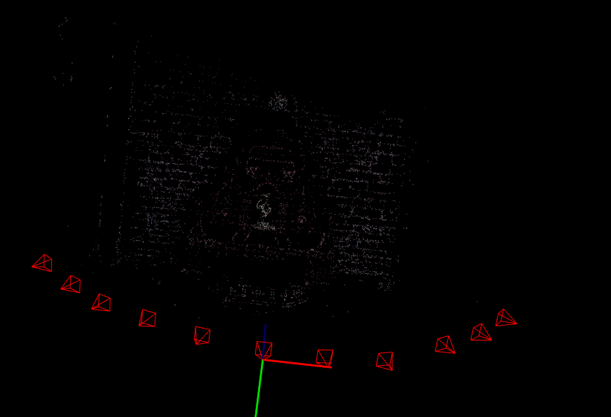

# my_sfm

**my_sfm** is an implementation of Incremental Structure-from-Motion pipeline. 
This implementation tried to imitate [COLMAP](https://demuc.de/papers/schoenberger2016sfm.pdf).

It is designed to work with uncalibrated cameras, and it will optimize the camera parameters via bundle adjustment.



# How to run
## Build

Install dependences (listed below).\
Clone this repository\
Compile: 
```bash
mkdir build && cd build
cmake ..
make
```

## Details
### 1. Data Association
The first step is to extract keypoints and matches from the images, then store it in the database (`database.db`).

It perform SIFT feature extraction, then exhaustive matching for all image pairs and verify using RANSAC.
```bash
cd ~/my_sfm/build/my_sfm
./main data_association <path to yaml config file>
```
### 2. Incremental Reconstruction
The second step performs sparse reconstruction with image registration, bundle adjustment and outlier filtering.

The result point cloud and camera parameters will be stored at `points3D.txt` and `cameras.txt`, respectively.

First, it intialize with 2 views that have the most overlapping pairs.

Then, until all images are added, it registers the images (PnP problem), triangulating new points, and refine using bundle adjustment. After that, it remove outliers (points behind camera or small triangulation angle).
```bash
./main reconstruction <path to yaml config file>
```

### 3. Visualization
Visualize the sparse reconstruction.
```bash
./main viz <path to yaml config file>
```

# Dependencies

### OS
Tested on Debian 12.

### C++17

### CMake
```bash
sudo apt install cmake
```
### OpenCV
```bash
sudo apt install libopencv-dev
```

### SQlite3
```bash
sudo apt-get install sqlite3 libsqlite3-dev
```

### yaml-cpp: yaml parsing
```bash
sudo apt install libyaml-cpp-dev
```

### Ceres Solver 2.2: Non-linear Optimization and Bundle Adjustment
Download latest stable release from [link](http://ceres-solver.org/installation.html)
```bash
# google-glog + gflags
sudo apt-get install libgoogle-glog-dev libgflags-dev
# Use ATLAS for BLAS & LAPACK
sudo apt-get install libatlas-base-dev
# Eigen3
sudo apt-get install libeigen3-dev
# SuiteSparse
sudo apt-get install libsuitesparse-dev

tar zxf ceres-solver-2.2.0.tar.gz
mkdir ceres-bin
cd ceres-bin
cmake ../ceres-solver-2.2.0
make -j3
make test
make install
```
